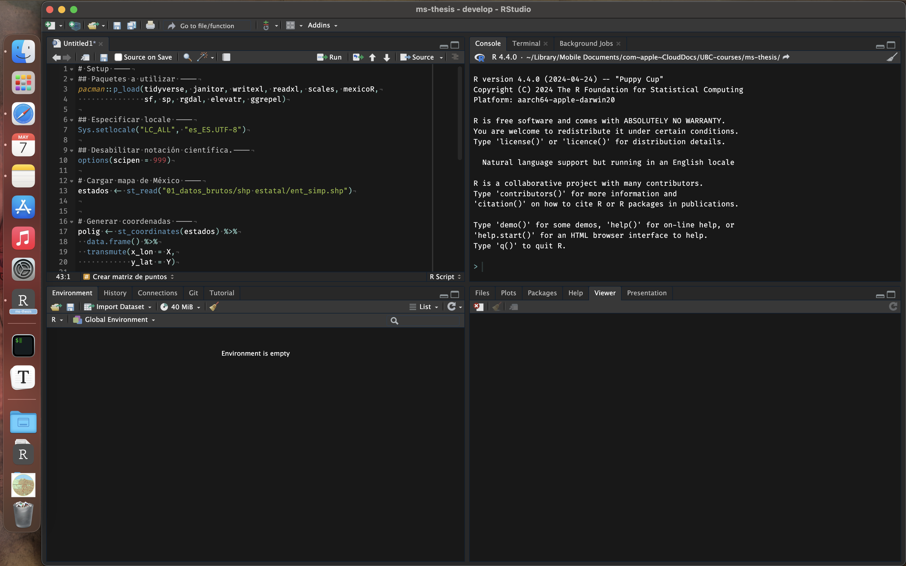

# appear-RStudio

This repository contains my personal customizations of RStudio in Mac, including a [dark icon by Amir Masoud](https://github.com/amirmasoudabdol/rstudio-icons?tab=readme-ov-file), a theme based on [{rsthemes}](https://github.com/gadenbuie/rsthemes) and [CodeFira](https://github.com/tonsky/FiraCode) font. The final look should be similar to this.



- [Getting Started](#getting-Started)
  - [Prerequisites](#prerequisites)
  - [Installing](#installing)
- [Acknowledgments](#acknowledgments)

## Getting Started

### Prerequisites

Tho work, it is necessary to have:

* R,
* RStudio and
* [Homebrew](https://brew.sh).

### Installing

To install the customization, please run the following code in the terminal.
``` bash
bash <(curl -s https://raw.githubusercontent.com/JavierMtzRdz/appear-RStudio/main/code/appear.sh)

# or

/bin/bash -c "$(curl -fsSL https://raw.githubusercontent.com/JavierMtzRdz/appear-RStudio/main/code/appear.sh)"
```

## Contributing

Pull requests are welcome. For major changes, please open an issue first to discuss what you would like to change.

Please make sure to update tests as appropriate.

## Acknowledgments

-  [Dark icon by Amir Masoud](https://github.com/amirmasoudabdol/rstudio-icons?tab=readme-ov-file).
- Theme based on [{rsthemes}](https://github.com/gadenbuie/rsthemes).
- [CodeFira](https://github.com/tonsky/FiraCode).
